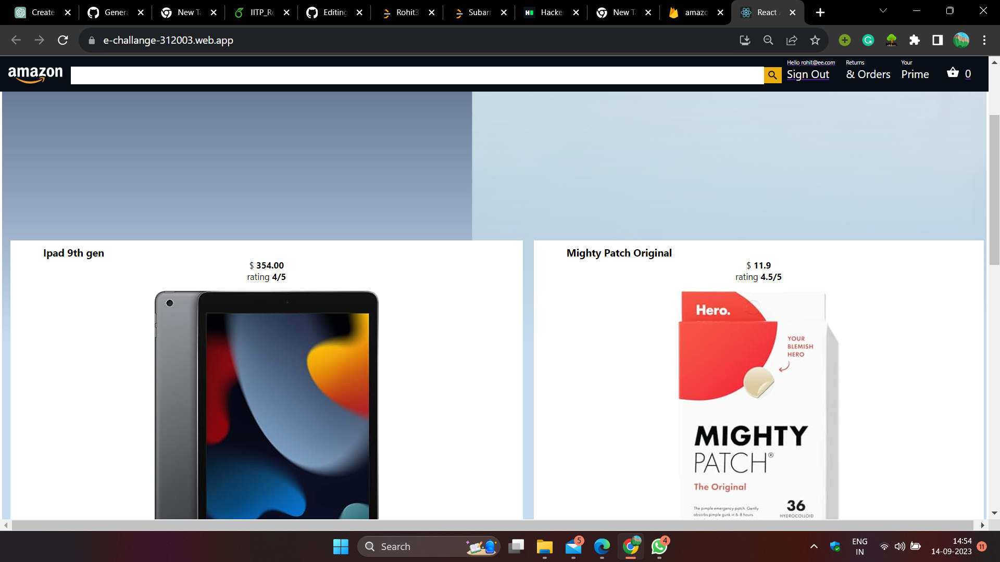

# E-commerce Website with React and Firebase Hosting

This e-commerce website uses React for the front end and Firebase for hosting and user authentication. It provides a seamless shopping experience for users, allowing them to browse a catalog of products, add items to their cart, and complete the checkout process. The website also incorporates responsive design principles to ensure a consistent and user-friendly experience across various devices and screen sizes.



## Table of Contents
- [Demo](#demo)
- [Features](#features)
- [Technologies Used](#technologies-used)
- [Installation](#installation)
- [Configuration](#configuration)
- [Usage](#usage)
- [Deployment](#deployment)


## Demo
[Link to the live demo of your website on Firebase](https://e-challange-312003.web.app/)


## Features

1. **User Registration and Sign-Up:**
   - Users can create accounts and sign up with ease using Firebase Authentication.
   - Enhanced security with email verification and password reset functionalities.

2. **Responsive Design:**
   - The website is designed to be responsive, ensuring a consistent and visually appealing user experience across various devices, including desktops, tablets, and mobile phones.

3. **Product Catalog:**
   - Display a comprehensive catalog of products, complete with images, detailed descriptions, prices, and product specifications.
   - Users can easily find products with powerful search and filtering options.

4. **Shopping Cart:**
   - Users can add products to their shopping cart with a simple click.
   - The cart provides an organized list of selected items, including quantities, individual prices, and a calculated total.

5. **Cart Manipulation:**
   - Allow users to adjust item quantities within the cart by incrementing or decrementing.
   - Provide a convenient option to remove items from the cart.

6. **Streamlined Checkout Process:**
   - Users can smoothly proceed from the cart to the checkout page.
   - Collect essential shipping and billing information from customers for efficient order processing.
   - Accurately calculate shipping fees and applicable taxes to present transparent pricing.


## Technologies Used
- React
- Firebase (Firebase Authentication, Firestore, Firebase Hosting)


## Installation
1. Clone this repository:

   ```bash
   [git clone https://github.com/sethiudit/E-commerce-web.git]

2. host
   ```bash
   [https://e-challange-312003.firebaseapp.com/]
